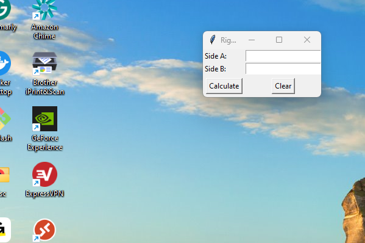
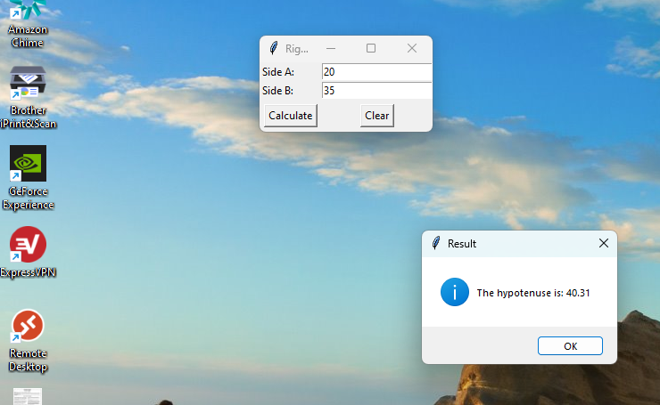
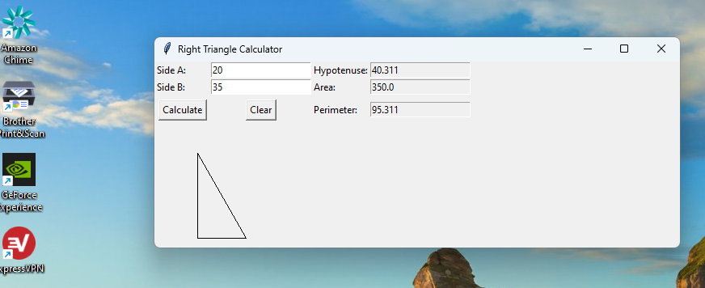

# TriangleCalc

  <h2 align="center">OOP Using Python</h2>

 

### Original Script

The original script would generate the GUI in a small window wich required resizing for better  viewing of the triangle calculations. The purpose of
This script is a simple program that calculates the hypotenuse  of a triangle given the lengths of its two shorter sides. 
 

In the original script, we used a pop up window to present the result of the  triangle calculation. Upon updating the script to add extra functions and therefore more results, the pop-up window seemed inefficient and bulky.

### New Features:

The new script has the following features added:
- A graphical representation of the triangle
- New functions such as calculating the perimeter and area of the triangle
- New fields that populate with the result of the calculations instead of a messge box
